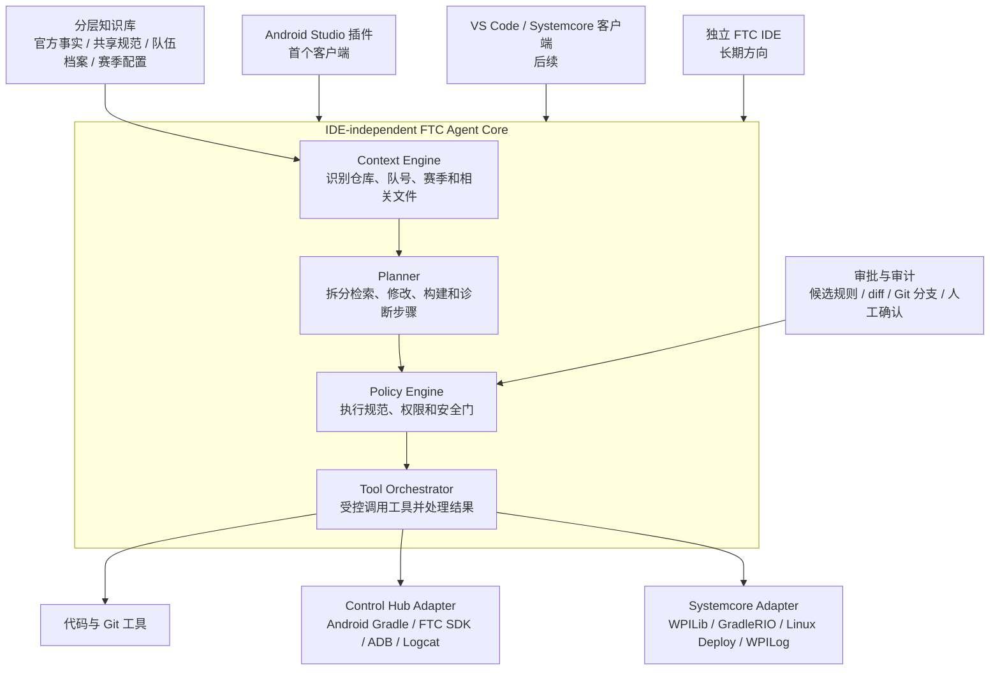

# FTC Knowledge Bank

一个面向 FTC 队伍的知识库与编程 Agent 项目。它将队伍认可的代码规范、常用工具、工程经验和安全约束整理成可检索、可审批、可验证的知识，使 AI Agent 在解释或修改机器人代码时遵循真实的队伍实践。

> 项目状态：早期设计阶段。本文描述当前已经确认的方向，不代表所有功能均已实现。

## 为什么需要这个项目

通用 AI Agent 可以生成 FTC 代码，但通常不了解具体队伍的：

- 工程结构、命名方式与代码风格；
- 常用库、定位方案和调参工具；
- 硬件封装、安全限制与部署流程；
- 历史经验、故障案例及设计原因。

本项目的目标不是让 Agent 替队员完成整套机器人软件设计，而是让它在明确规则和人工监督下完成解释、修改、审查、构建验证与错误诊断。

## 核心原则

### 1. 证据优先

知识按照来源和权威性管理：

1. FIRST 官方仓库和文档决定 SDK、工程结构、构建与部署兼容性；
2. 队伍代码仓库提供真实使用过的架构、工具和代码模式；
3. 队员补充代码中无法表达的经验、禁忌和设计原因；
4. Agent 从代码中总结出的内容只能先成为候选规范，不能自动升级为正式规范。

### 2. 人工审批

当前 Foundation 只接受具备对应审批角色的软件负责人：总软件负责人可批准官方规则和共享规则，对应队伍的软件负责人只能批准本队规则。队长只有在同时担任相应软件负责人角色时才具有该审批权限。Agent 的代码修改必须展示依据与 diff，并在独立 Git 分支中完成。上传到机器人控制器等可能影响真实硬件的操作必须由队员明确确认。

### 3. 可替换的平台适配器

知识库和 Agent 核心不绑定某一种 IDE 或控制系统。Android Studio 插件是计划中的首个客户端；构建、依赖管理和部署能力通过平台适配器接入，以便未来支持其他编辑器和 FTC 控制平台。

## 项目架构



知识库负责提供事实、规范和经验；Agent Core 负责选择上下文、制定步骤、执行规则、调用工具和验证结果；IDE 插件只负责呈现交互。将三者分开后，知识和工作流可以在不同 IDE 与控制平台之间复用。

### Agent Core 组件

| 组件 | 职责 |
| --- | --- |
| Context Engine | 识别仓库、队号、赛季、当前任务及相关代码和知识条目 |
| Planner | 将用户请求拆成可审查的检索、修改、构建和诊断步骤 |
| Policy Engine | 按权威层级加载规则，执行权限控制和硬件安全限制 |
| Tool Orchestrator | 调用代码搜索、文件编辑、Git、Gradle及平台工具，并保存结果 |
| Verification Loop | 根据 diff、构建输出和测试结果判断任务是否完成或需要诊断 |

## 双层知识库

同一份事实来源面向两种使用场景：

- **Agent 层**：提供必须遵守的工程结构、命名规范、工具选择、安全约束和验证流程；
- **队员层**：解释原理、使用步骤、调参经验和故障排查方法。

两层内容共享来源，避免面向 Agent 的规则与面向队员的文档互相矛盾。

### 知识与规则的优先级

```text
FIRST 官方约束（不可被覆盖）
    ↓
队号专属规范
    ↓
共享正式规范
```

该优先级只在规则主题相同且规则适用于当前队号、赛季上下文时参与解析；不同主题的规则不会互相覆盖。当前赛季配置与参数用于判断适用上下文，本身不是高于或低于上述权威层级的覆盖规则。

当前纳入 `20827` 和 `16093` 两个队号档案。档案可以保存队伍信息、赛季、机器人硬件配置、参数、已验证代码案例、经验以及经批准的专属规范。所有硬件参数、场地坐标和调参数据必须带队号、赛季与来源，防止旧机器人数据被错误复用。

官方规则和共享规范由总软件负责人批准；队号专属规范由对应队伍的软件负责人批准。Agent 从仓库中提取的模式只能进入候选状态，批准后才可约束代码修改。每条正式规则或覆盖规则需要记录适用范围、来源、批准人、状态和版本。

## Agent 权限模式

| 模式 | 能力 |
| --- | --- |
| Ask | 读取知识库，回答问题并解释现有代码 |
| Edit | 生成或修改代码，说明依据并展示 diff |
| Run | 执行构建、读取错误并协助诊断和修复 |

Agent 可以辅助队员分析需求，但机器人整体软件架构、机械与硬件方案等核心设计决策仍由队员负责。

## 第一个 MVP

首个可演示闭环计划为：

```text
导入队伍代码仓库
→ 分析工程结构与候选规范
→ 由具备对应权限的软件负责人批准规范
→ Agent 解释或修改代码
→ 展示修改依据与 diff
→ 运行 Gradle 构建验证
```

MVP 暂不包含自动安装依赖和自动上传到 Control Hub，但会为这些能力保留接口。所有 Agent 修改必须在独立 Git 分支中进行。

第一阶段只服务队伍内部。MVP 需要覆盖 Ask、Edit 和 Run 三种能力，但不替队员决定机器人整体软件架构、机械结构或硬件方案。

## Knowledge Core（Foundation）

当前首个可运行切片可以校验版本控制中的规则文件，并按队号和赛季解析生效规则。开发环境需要 **JDK 21**；项目使用 Gradle Wrapper，因此不需要另行安装系统级 Gradle。先确认 `java -version` 指向 JDK 21；若本机安装了多个 JDK，可在命令前临时设置 `JAVA_HOME`。

在仓库根目录通过 wrapper 运行 CLI：

```bash
./gradlew :apps:knowledge-cli:run --args="validate knowledge"
./gradlew :apps:knowledge-cli:run --args="resolve knowledge --team 20827 --season 2025-2026"
./gradlew test
```

知识文件采用 `schemaVersion: 1` 的 YAML，当前布局如下：

| 路径 | 内容 |
| --- | --- |
| `knowledge/official/rules.yaml` | FIRST 官方约束 |
| `knowledge/shared/rules.yaml` | 跨队共享规则与候选规则 |
| `knowledge/teams/<team>/rules.yaml` | 队号专属规则、适用赛季与来源 |
| `knowledge/schema/examples/rule-example.yaml.example` | 可复制的字段示例，不会被 CLI 当作规则加载 |

每条规则记录 `id`、`topic`、可执行的 `instruction`、`rationale`、`status`、`authority`、适用队号/赛季及精确到仓库、commit 和文件位置的 `evidence`。正式规则还必须包含经过权限校验的 `approval`。

候选规则不会自动生效：共享规则和官方规则只能由总软件负责人批准，队号专属规则只能由对应队伍的软件负责人批准。批准后仍按“官方约束 > 队号专属规范 > 共享规范”解析；同一权威层级、同一主题的冲突会阻止解析。校验错误和该类冲突均返回非零退出码，`candidate`、`deprecated` 和 `rejected` 状态都不会进入生效结果。

## 参考仓库

- [FIRST-Tech-Challenge/FtcRobotController](https://github.com/FIRST-Tech-Challenge/FtcRobotController)：官方 FTC 工程与 SDK 基线；
- [xiaokai-lyk/FTC20827-2026Decode](https://github.com/xiaokai-lyk/FTC20827-2026Decode)：队伍工程实践参考；
- [tqdmye/FTC2026-16093National](https://github.com/tqdmye/FTC2026-16093National)：另一份队伍工程实践参考。

来自队伍仓库的模式不会被直接视为正式规范：多个仓库共同采用且质量良好的模式可成为强候选规范，单个仓库特有的模式需要保留来源，重复、冲突或疑似遗留代码则进入待审查列表。

## Control Hub 与 Systemcore

当前适配器面向基于 Android 的 FTC SDK 与 Control Hub。FIRST 已宣布从 2027–2028 赛季开始引入基于 Raspberry Pi CM5 和实时 Linux 的 Systemcore；其 Alpha 软件基于 WPILib、GradleRIO 和 Linux 部署，而不是当前的 Android APK 与 ADB 流程。

因此，知识检索、规则、Agent 工作流和审批机制保持平台无关，构建、依赖、日志与部署通过独立适配器实现。Systemcore 仍处于测试和演进阶段，具体兼容工作以 FIRST 与 WPILib 的正式发布为准。

- [FIRST：FTC 新控制系统概览](https://community.firstinspires.org/control-system-update-first-tech-challenge-edition)
- [Systemcore 与 Motioncore 测试仓库](https://github.com/wpilibsuite/SystemcoreTesting)
- [WPILib 2027 变化](https://docs.wpilib.org/en/latest/docs/yearly-overview/yearly-changelog.html)

## Foundation 状态与未来待决定事项

知识条目的 YAML 格式、状态模型、证据字段、审批记录和权威层级已经在 Foundation 中确定并实现。这不表示仓库分析、候选规范自动提取、模型集成或完整 Agent 工作流已经实现。

以下未来设计仍待决定：

- Android Studio 插件与 FTC Agent Core 的具体通信接口；
- 模型与供应商接口、代码隐私边界及密钥管理；
- Agent SDK 选型、运行时编排方式及工具调用边界；
- 后续 Ask、Edit、Run 能力的技术栈和测试策略。

完整的近期任务和长期设想见 [`todolist.md`](todolist.md)。
