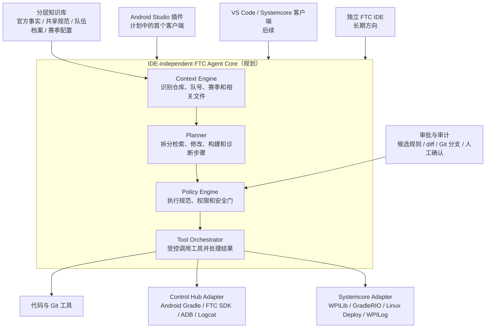

# FTC Knowledge Bank

一个面向 FTC 队伍的知识库与编程 Agent 项目。它将队伍认可的代码规范、常用工具、工程经验和安全约束整理成可检索、可审批、可验证的知识，使 AI Agent 在解释或修改机器人代码时遵循真实的队伍实践。

## 项目状态

当前仓库已经完成 **Knowledge Core Foundation**，但完整 FTC 编程 Agent 和 IDE 客户端尚未实现。

| 状态 | 能力 |
| --- | --- |
| 已实现 | schema v1 规则模型、严格本地 YAML 加载、证据与审批校验、规则优先级和冲突解析、`validate` / `resolve` CLI、20827 与 16093 初始档案、自动化测试 |
| 部分完成 | `knowledge/` 当前包含 4 条规则：1 条已批准官方规则和 3 条来自参考仓库的候选规则；队伍知识内容仍需扩充 |
| 尚未实现 | 自动导入和分析 FTC 仓库、候选规范提取、审批 UI/历史、Ask/Edit/Run Agent、Android Studio 插件、Control Hub 部署、Pedro Pathing 与 Limelight 新人内容 |

当前使用 JDK 21 验证的测试套件有 59 项测试全部通过；这是当前快照，测试数量会随功能增长。

## 5 分钟快速开始

### 1. 获取仓库

```bash
git clone https://github.com/lucasnotfound59/FTC-Knowledge-Bank.git
cd FTC-Knowledge-Bank
```

以下所有命令都在刚进入的仓库根目录运行。

### 2. 准备环境

需要安装：

- Git；
- JDK 21；
- 无需安装系统级 Gradle，仓库已包含 Gradle Wrapper。

先确认当前 Java 版本：

```bash
java -version
```

输出中的主版本应为 `21`。如果 macOS 已安装 Android Studio，可以临时使用它自带的 JDK 21：

```bash
export JAVA_HOME='/Applications/Android Studio.app/Contents/jbr/Contents/Home'
```

如果 Android Studio 安装在其他位置，或使用单独安装的 JDK 21，请把 `JAVA_HOME` 指向相应目录。

Windows PowerShell 不应假设 Android Studio 的安装位置。将下面的占位路径换成实际 JDK 21 目录，再重新检查版本：

```powershell
$env:JAVA_HOME='C:\Path\To\jdk-21'
$env:Path="$env:JAVA_HOME\bin;$env:Path"
java -version
```

### 3. 校验并解析规则

在 macOS 或 Linux 的仓库根目录运行：

```bash
./gradlew :apps:knowledge-cli:run --args="validate knowledge" --quiet
./gradlew :apps:knowledge-cli:run --args="resolve knowledge --team 20827 --season 2025-2026" --quiet
```

Windows PowerShell 使用 wrapper 的 `.bat` 文件：

```powershell
.\gradlew.bat :apps:knowledge-cli:run --args="validate knowledge" --quiet
.\gradlew.bat :apps:knowledge-cli:run --args="resolve knowledge --team 20827 --season 2025-2026" --quiet
```

后文所有 `./gradlew` 命令在 Windows 上都替换为 `.\gradlew.bat`。

准确输出为：

```text
validation=ok rules=4
active official.keep-customizations-in-teamcode
```

另外 3 条规则都是 `candidate`，因此没有出现在 active 输出中是正确结果，也证明候选规则不会自动生效。

## 完整使用手册

- [知识库目录](#知识库目录)
- [规则字段说明](#规则字段说明)
- [创建候选规则](#创建候选规则)
- [添加审批](#添加审批)
- [校验和解析](#校验和解析)
- [团队协作流程](#团队协作流程)
- [CLI 退出码](#cli-退出码)
- [常见问题](#常见问题)
- [开发与验证](#开发与验证)

### 知识库目录

CLI 会递归读取知识根目录中扩展名为小写 `.yaml` 或 `.yml` 的文件。当前约定布局如下：

| 路径 | 含义 |
| --- | --- |
| `knowledge/official/rules.yaml` | FIRST 官方约束 |
| `knowledge/shared/rules.yaml` | 跨队共享规则与候选规则 |
| `knowledge/teams/<team>/rules.yaml` | 队号专属规则与候选规则 |
| `knowledge/schema/examples/rule-example.yaml.example` | 可复制的完整示例；它既不是 `.yaml` 也不是 `.yml`，不会被递归加载 |

所有规则文件都是一个 schema v1 YAML 文档。不要在这些文件中保存密钥、机器人凭据或其他秘密。

### 规则字段说明

根对象有两个必填字段：

| 字段 | 类型 | 说明 |
| --- | --- | --- |
| `schemaVersion` | 整数 | 必须为 `1` |
| `rules` | 列表 | 规则列表，可以为空 |

每条规则支持以下全部 schema v1 字段：

| 字段 | 必填 | 类型/可选值 | 说明 |
| --- | --- | --- | --- |
| `id` | 是 | 字符串 | 全库唯一、稳定的规则标识 |
| `topic` | 是 | 字符串 | 用于优先级与冲突解析的规范主题 slug |
| `title` | 是 | 非空字符串 | 便于人阅读的短标题 |
| `instruction` | 是 | 非空字符串 | 代码或使用者应执行的明确动作 |
| `rationale` | 是 | 非空字符串 | 采用这条规则的原因 |
| `status` | 是 | `candidate` / `approved` / `deprecated` / `rejected` | 规则生命周期状态 |
| `authority` | 是 | `official` / `team` / `shared` | 权威层级 |
| `applicability` | 否 | 对象 | 适用队伍和赛季；省略等同于两个列表均为空 |
| `evidence` | 是 | 非空列表 | 一个或多个可追溯证据对象 |
| `approval` | 否 | 对象 | 只有 `approved` 规则必须且可以包含 |
| `supersedes` | 否 | 字符串 | 被替代规则的标识元数据；当前解析器不会仅凭此字段改变优先级 |
| `positiveExample` | 否 | 字符串 | 正确做法示例 |
| `negativeExample` | 否 | 字符串 | 错误做法示例 |

`applicability` 字段：

| 字段 | 必填 | 类型 | 说明 |
| --- | --- | --- | --- |
| `teams` | 否 | 字符串列表 | 适用队号；空列表表示不限制队号。`team` 权威规则至少要有一个队号 |
| `seasons` | 否 | 字符串列表 | 适用赛季；空列表表示不限制赛季 |

每个 `evidence` 对象：

| 字段 | 必填 | 类型 | 说明 |
| --- | --- | --- | --- |
| `repository` | 是 | 非空字符串 | 来源仓库，例如 `owner/repository` |
| `commit` | 是 | 字符串 | 精确 Git commit，7–64 位十六进制字符 |
| `file` | 是 | 字符串 | 仓库相对路径 |
| `symbol` | 条件必填 | 非空字符串 | 来源类、方法或符号；它与正整数 `line` 至少提供一个 |
| `line` | 条件必填 | 正整数 | 来源行号；它与非空 `symbol` 至少提供一个 |

`approval` 对象：

| 字段 | 必填 | 类型/可选值 | 说明 |
| --- | --- | --- | --- |
| `approver` | 是 | 非空字符串 | 审批人标识 |
| `role` | 是 | `overall_software_lead` / `team_software_lead` | 审批角色 |
| `team` | 否 | 仅数字字符串 | 队伍软件负责人审批 team 规则时必须提供并匹配唯一适用队号 |
| `approvedAt` | 是 | ISO-8601 时间字符串 | 可被 `Instant` 解析的审批时间，例如 `2026-08-13T00:00:00Z` |

`status`、`authority` 和 `role` 的值解析时不区分大小写，但仓库统一使用表中的小写形式，避免无意义的格式差异。

字段格式必须严格满足：

```text
id: ^[a-z0-9]+(?:[.-][a-z0-9]+)*$
topic: ^[a-z0-9]+(?:-[a-z0-9]+)*$
team: ^[0-9]+$
season: ^[0-9]{4}-[0-9]{4}$
commit: 7–64 hexadecimal characters
file: repository-relative, / separators only, no absolute path, backslash, empty segment, . or .. segment
line: positive integer
```

schema v1 采取严格解码：未知字段、重复 YAML 键、错误的集合或标量类型，以及不安全的 YAML 对象标签都会报错，而不会被静默忽略。规则 `id` 在整个知识根目录中也不能重复。

### 创建候选规则

1. 不要覆盖已有的 `rules.yaml`。推荐在对应 authority 目录创建一个名称唯一的新文件，例如 `knowledge/teams/20827/example.yaml`。
2. 新文件必须是完整文档，包含一次 `schemaVersion: 1` 和一次 `rules:`。可以参考 `knowledge/schema/examples/rule-example.yaml.example`，但不要直接将示例文件改名后放进加载目录。
3. 如果选择编辑已有文件，只把单条以 `- id:` 开头的 list item 追加到原有 `rules:` 列表下；不能再次写入 `schemaVersion` 或第二个 `rules` 根键。
4. 从仓库总结出的知识必须先写成 `status: candidate`，且不含 `approval`。
5. 填写精确的仓库、commit、文件以及非空 symbol 或正整数 line 证据。
6. 保存后运行 `validate`。校验通过只表示格式与规则约束正确，不代表候选规则已经获批或生效。

完整的 team 候选规则示例：

```yaml
schemaVersion: 1
rules:
  - id: team-20827.example-candidate
    topic: example-topic
    title: Example team practice
    instruction: Describe one action the code should follow.
    rationale: Explain why team 20827 uses this practice.
    status: candidate
    authority: team
    applicability:
      teams: ["20827"]
      seasons: [2025-2026]
    evidence:
      - repository: owner/repository
        commit: abcdef1234567890
        file: TeamCode/src/main/java/example/Example.java
        symbol: Example
```

运行校验：

```bash
./gradlew :apps:knowledge-cli:run --args="validate knowledge" --quiet
```

合法的 `candidate` 会通过校验，但不会出现在 `resolve` 的 active 输出中。

### 添加审批

审批必须在原 candidate 的同一条目内完成：保留它的 `id`、内容、适用范围和证据，把 `status` 从 `candidate` 改为 `approved`，再添加 `approval`。不要把审批片段另存成独立规则文件。

官方规则和共享规则只能由总软件负责人审批。下面是一个完整、可校验的 approved shared 规则文档：

```yaml
schemaVersion: 1
rules:
  - id: shared.example-approved
    topic: example-shared-practice
    title: Example shared practice
    instruction: Describe one shared action the code should follow.
    rationale: Explain why multiple teams use this practice.
    status: approved
    authority: shared
    applicability:
      seasons: [2025-2026]
    evidence:
      - repository: owner/repository
        commit: abcdef1234567890
        file: TeamCode/src/main/java/example/SharedExample.java
        symbol: SharedExample
    approval:
      approver: overall-software-lead
      role: overall_software_lead
      approvedAt: 2026-08-13T00:00:00Z
```

team 规则只能由该队的软件负责人审批，并且规则必须只适用于审批人对应的同一个队号。完整文档示例：

```yaml
schemaVersion: 1
rules:
  - id: team-20827.example-approved
    topic: example-team-practice
    title: Example team practice
    instruction: Describe one action team 20827 code should follow.
    rationale: Explain why team 20827 uses this practice.
    status: approved
    authority: team
    applicability:
      teams: ["20827"]
      seasons: [2025-2026]
    evidence:
      - repository: owner/repository
        commit: abcdef1234567890
        file: TeamCode/src/main/java/example/TeamExample.java
        symbol: TeamExample
    approval:
      approver: lead-20827
      role: team_software_lead
      team: "20827"
      approvedAt: 2026-08-13T00:00:00Z
```

`approved` 规则如果缺少审批会校验失败，非 `approved` 规则则不能包含审批。当前审批只是受校验、受版本控制的 YAML 元数据，尚未实现审批 UI 或不可变审批历史。

### 校验和解析

校验整个知识根目录：

```bash
./gradlew :apps:knowledge-cli:run --args="validate knowledge" --quiet
```

为指定队伍和赛季解析 active 规则：

```bash
./gradlew :apps:knowledge-cli:run --args="resolve knowledge --team 20827 --season 2025-2026" --quiet
```

解析规则如下：

- 只有 `approved` 规则能够生效；`candidate`、`deprecated` 和 `rejected` 都不生效。
- `applicability.teams` 和 `applicability.seasons` 分别按队号和赛季过滤；空列表表示不限制该维度。
- 同一规范主题且适用于当前上下文时，优先级为 `OFFICIAL > TEAM > SHARED`。
- 同一主题在最高有效权威层级有两条或更多适用规则时会产生 conflict，该主题没有 active 胜者。
- resolver 内部仍会计算其他无冲突主题的 active 规则；但只要本次解析存在任何 conflict，CLI 就会按 topic 输出所有 `conflict` 行，抑制本次全部 `active` 行，并以退出码 `2` 结束。
- 没有冲突时，不同主题互不覆盖；CLI 的 active 输出按规则 `id` 确定性排序。

### 团队协作流程

```text
队员识别可复用经验
→ 写入 candidate 并附 repository/commit/file/symbol-or-line 证据
→ 运行 validate
→ 软件负责人审查 instruction、rationale、适用范围和证据
→ 授权负责人添加 approval 并改为 approved
→ 再次 validate 和 resolve
→ 通过 Git review 合并
```

普通贡献者可以提出候选规则，但不能自行声明并不具备的审批角色。审批者应确认规则内容、证据、适用范围和自身权限，而不是只检查 YAML 能否通过解析。

### CLI 退出码

通用语法：

```text
knowledge-cli validate <knowledge-root>
knowledge-cli resolve <knowledge-root> --team <digits> --season <YYYY-YYYY>
```

通过 Gradle Wrapper 调用时，把上述参数放入 `--args="..."`。

| 退出码 | 含义 |
| --- | --- |
| `0` | 校验或解析成功 |
| `2` | 知识加载、schema 校验、规则校验或解析冲突失败 |
| `64` | 命令语法错误、缺少 `<knowledge-root>`、缺少/重复/未知选项，或 team/season 参数格式无效 |

CLI 的错误信息写到标准输出；脚本应同时检查退出码，不要只匹配文字。

### 常见问题

| 现象 | 常见原因 | 处理方法 |
| --- | --- | --- |
| Gradle 找不到 JDK 21 toolchain | `JAVA_HOME` 或本机 Java 版本不对 | 运行 `java -version`；把 `JAVA_HOME` 指向 JDK 21。macOS 可使用上文 Android Studio JBR 路径 |
| `error loading knowledge`（退出 `2`） | YAML 语法错误、重复键、未知字段、类型错误、错误 schema 版本，或 `<knowledge-root>` 指向不存在/非目录路径 | 阅读冒号后的首行详情，确认目录存在并检查最近编辑的 `.yaml`/`.yml`，再运行 `validate` |
| `invalid rule id` 或 `topic must be a canonical slug` | `id`/`topic` 含大写、空格、下划线或不允许的分隔方式 | 按上文正则改成小写 canonical 格式；`id` 可用 `.`/`-`，`topic` 只用 `-` |
| `commit must be a Git SHA` 或 evidence file 错误 | commit 不是 7–64 位十六进制，或 file 是绝对路径、含反斜杠、空段、`.`/`..` | 使用真实 commit SHA 和 `/` 分隔的仓库相对路径 |
| `approved rule requires approval` | 已将状态改为 approved，但审批对象缺失 | 根据 authority 添加正确的 `approval`；不要伪造审批角色 |
| `approval is not authorized for rule authority and teams` | official/shared 使用了队伍负责人，或 team 审批队号与唯一适用队号不一致 | official/shared 改由 `overall_software_lead` 审批；team 由匹配队号的 `team_software_lead` 审批 |
| candidate 校验通过但没有 active 输出 | 这是预期行为，候选规则尚未获批 | 由授权负责人审查；获批后添加 approval、改为 approved，再 validate/resolve |
| 输出 `conflict topic=... rules=...` | 同一 topic 的最高有效权威层级有多条适用规则 | 调整适用范围、合并/废弃冲突规则或保留一个获批规则，然后重新解析 |
| CLI 退出 `64` | 缺少命令或 `<knowledge-root>`，或选项/参数格式错误 | 对照通用语法；resolve 必须各提供一次 `--team <digits>` 和 `--season <YYYY-YYYY>`。已提供但不存在的目录属于 load failure，退出 `2` |

### 开发与验证

当前 Gradle 构建包含三个模块：

| 模块 | 职责 |
| --- | --- |
| `modules/domain` | 规则值对象、校验、审批策略和解析 |
| `modules/knowledge` | 严格 YAML 解码和文件系统知识库加载 |
| `apps/knowledge-cli` | 面向使用者的 validate/resolve 命令与退出码 |

在 JDK 21 环境运行全量测试：

```bash
./gradlew clean test
```

2026-08-13 的当前快照为 59 项测试全部通过；测试数量会随功能增长，以本地最新结果为准。

## 为什么需要这个项目

通用 AI Agent 可以生成 FTC 代码，但通常不了解具体队伍的：

- 工程结构、命名方式与代码风格；
- 常用库、定位方案和调参工具；
- 硬件封装、安全限制与部署流程；
- 历史经验、故障案例及设计原因。

本项目的目标不是让 Agent 替队员完成整套机器人软件设计，而是让它未来在明确规则和人工监督下完成解释、修改、审查、构建验证与错误诊断。

## 核心原则

### 1. 证据优先

知识按照来源和权威性管理：

1. FIRST 官方仓库和文档决定 SDK、工程结构、构建与部署兼容性；
2. 队伍代码仓库提供真实使用过的架构、工具和代码模式；
3. 队员补充代码中无法表达的经验、禁忌和设计原因；
4. Agent 从代码中总结出的内容只能先成为候选规范，不能自动升级为正式规范。

### 2. 人工审批与安全门

候选提出与正式批准必须分离，审批人只能使用自己真实具备的授权角色。当前 Foundation 的准确角色、队号匹配条件和 YAML 写法见[添加审批](#添加审批)。

未来 Agent 的代码修改应展示依据与 diff，并在独立 Git 分支中完成。Control Hub 部署和其他可能影响真实硬件的操作尚未实现；未来实现时也必须由队员明确确认。

### 3. 可替换的平台适配器

知识库和规划中的 Agent 核心不绑定某一种 IDE 或控制系统。Android Studio 插件是计划中的首个客户端；构建、依赖管理和部署能力将通过平台适配器接入，以便未来支持其他编辑器和 FTC 控制平台。

## 项目架构（规划）

下图描述目标架构，而不是当前 Foundation 已经实现的组件清单。



目标中，知识库负责提供事实、规范和经验；Agent Core 负责选择上下文、制定步骤、执行规则、调用工具和验证结果；IDE 插件只负责呈现交互。三者分开后，知识和工作流可以在不同 IDE 与控制平台之间复用。

### 规划中的 Agent Core 组件

| 组件 | 计划职责 |
| --- | --- |
| Context Engine | 识别仓库、队号、赛季、当前任务及相关代码和知识条目 |
| Planner | 将用户请求拆成可审查的检索、修改、构建和诊断步骤 |
| Policy Engine | 按权威层级加载规则，执行权限控制和硬件安全限制 |
| Tool Orchestrator | 调用代码搜索、文件编辑、Git、Gradle 及平台工具，并保存结果 |
| Verification Loop | 根据 diff、构建输出和测试结果判断任务是否完成或需要诊断 |

## 双层知识库

同一份事实来源面向两种使用场景：

- **Agent 层**：未来向 Agent 提供必须遵守的工程结构、命名规范、工具选择、安全约束和验证流程；
- **队员层**：当前和未来都可用于解释原理、使用步骤、调参经验和故障排查方法。

两层内容共享来源，避免面向 Agent 的规则与面向队员的文档互相矛盾。

### 分层治理原则

FIRST 官方约束、队号专属规范和共享正式规范应保持清晰的权威边界。当前 Foundation 对同主题规则的准确优先级、适用性过滤和冲突行为见[校验和解析](#校验和解析)，避免在概念说明中维护第二份实现契约。

当前纳入 `20827` 和 `16093` 两个队号的初始档案。档案未来可以继续保存队伍信息、赛季、机器人硬件配置、参数、已验证代码案例和经验。所有硬件参数、场地坐标和调参数据都应带队号、赛季与来源，防止旧机器人数据被错误复用。

## Agent 权限模式（规划）

Ask、Edit 和 Run 尚未实现。计划边界如下：

| 模式 | 计划能力 |
| --- | --- |
| Ask | 读取知识库，回答问题并解释现有代码 |
| Edit | 生成或修改代码，说明依据并展示 diff |
| Run | 执行构建、读取错误并协助诊断和修复 |

未来 Agent 可以辅助队员分析需求，但机器人整体软件架构、机械与硬件方案等核心设计决策仍由队员负责。

## 第一个 MVP（规划）

首个可演示闭环计划为：

```text
导入队伍代码仓库
→ 分析工程结构与候选规范
→ 由具备对应权限的软件负责人批准规范
→ Agent 解释或修改代码
→ 展示修改依据与 diff
→ 运行 Gradle 构建验证
```

MVP 暂不包含自动安装依赖和自动上传到 Control Hub，但会为这些能力保留接口。未来所有 Agent 修改应在独立 Git 分支中进行。

第一阶段只服务队伍内部。MVP 计划覆盖 Ask、Edit 和 Run 三种能力，但不替队员决定机器人整体软件架构、机械结构或硬件方案。

## 参考仓库

- [FIRST-Tech-Challenge/FtcRobotController](https://github.com/FIRST-Tech-Challenge/FtcRobotController)：官方 FTC 工程与 SDK 基线；
- [xiaokai-lyk/FTC20827-2026Decode](https://github.com/xiaokai-lyk/FTC20827-2026Decode)：队伍工程实践参考；
- [tqdmye/FTC2026-16093National](https://github.com/tqdmye/FTC2026-16093National)：另一份队伍工程实践参考。

来自队伍仓库的模式不会被直接视为正式规范：多个仓库共同采用且质量良好的模式可成为强候选规范，单个仓库特有的模式需要保留来源，重复、冲突或疑似遗留代码则进入待审查列表。

## Control Hub 与 Systemcore

当前仓库尚未实现任何平台适配器。规划中的首个适配器面向基于 Android 的 FTC SDK 与 Control Hub。FIRST 已宣布从 2027–2028 赛季开始引入基于 Raspberry Pi CM5 和实时 Linux 的 Systemcore；其 Alpha 软件基于 WPILib、GradleRIO 和 Linux 部署，而不是当前的 Android APK 与 ADB 流程。

因此，知识检索、规则、Agent 工作流和审批机制将保持平台无关，构建、依赖、日志与部署将通过独立适配器实现。Systemcore 仍处于测试和演进阶段，具体兼容工作以 FIRST 与 WPILib 的正式发布为准。

- [FIRST：FTC 新控制系统概览](https://community.firstinspires.org/control-system-update-first-tech-challenge-edition)
- [Systemcore 与 Motioncore 测试仓库](https://github.com/wpilibsuite/SystemcoreTesting)
- [WPILib 2027 变化](https://docs.wpilib.org/en/latest/docs/yearly-overview/yearly-changelog.html)

## Foundation 状态与未来待决定事项

知识条目的 YAML 格式、状态模型、证据字段、审批记录和权威层级已经在 Foundation 中确定并实现。这不表示仓库分析、候选规范自动提取、模型集成或完整 Agent 工作流已经实现。

以下未来设计仍待决定：

- Android Studio 插件与 FTC Agent Core 的具体通信接口；
- 模型与供应商接口、代码隐私边界及密钥管理；
- Agent SDK 选型、运行时编排方式及工具调用边界；
- 后续 Ask、Edit、Run 能力的技术栈和测试策略。

完整的近期任务和长期设想见 [`todolist.md`](todolist.md)。
