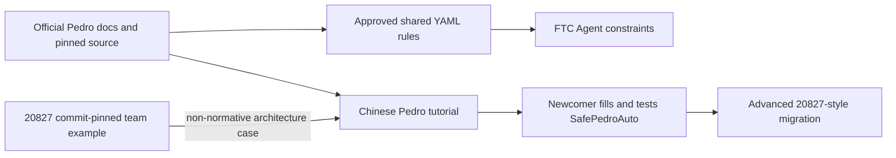
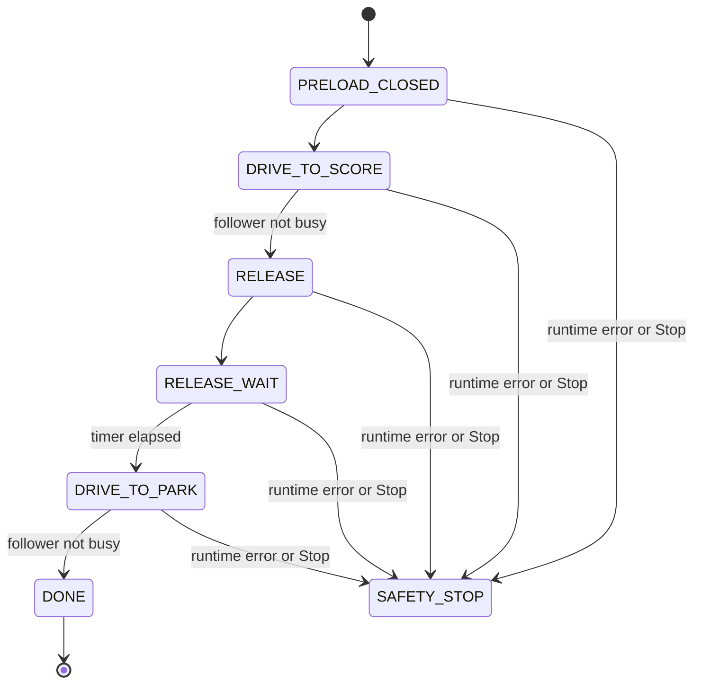

# Pedro Pathing Newcomer Auto Tutorial Design

Date: 2026-08-13

Status: Approved for implementation planning

Parent design: `docs/superpowers/specs/2026-08-13-ftc-tool-knowledge-design.md`

Reference implementation: FTC 20827 `FTC20827-2026Decode`, commit `118c28e137334bbbea510d77f1fa384e8b1b5779`

## 1. Objective

Extend the existing Pedro Pathing knowledge vertical with a newcomer-oriented, end-to-end autonomous tutorial. A student should be able to determine what values must be supplied, where each value comes from, how to enter it, and how to validate it safely.

The tutorial uses a simplified version of team 20827's autonomous architecture without copying its robot-specific mechanisms, poses, tuned constants, or match strategy.

Success means that a newcomer can:

1. install and pin a supported Pedro Pathing version;
2. configure drivetrain and localization constants;
3. follow the official tuning order;
4. fill every required field in a safe example Auto;
5. validate the Servo and drive separately before running the full routine; and
6. understand how the simple example maps to 20827's more advanced command-based structure.

## 2. Authority and Provenance

Technical claims about Pedro installation, APIs, coordinates, localization, tuning, path completion, and supported behavior use first-party Pedro documentation or commit-pinned Pedro source.

The 20827 repository is a non-normative architecture case study. It supports explanations of how one team organizes an Auto, but it does not create a shared machine-enforceable rule and is never presented as the Pedro-required structure.

The tutorial labels the following separately:

- **Pedro requirement**: backed by official Pedro evidence;
- **beginner safety convention**: introduced by this tutorial;
- **20827-inspired pattern**: adapted from the referenced team repository;
- **robot-specific value**: must be measured, selected, or tuned for the current robot.

## 3. Confirmed Design Decisions

- Keep the dual layer: YAML for Agent-enforceable rules and Markdown for human learning.
- Build the first complete vertical slice around Pedro Pathing before expanding the same pattern to goBILDA and Limelight.
- Write a cross-team Chinese tutorial with bilingual technical terms on first use.
- Pin examples to a stable Pedro release verified at implementation time.
- Cover installation, dependencies, Constants, Localizer choices, tuning, first path, validation, and troubleshooting.
- Explain every officially supported Localizer choice, but fully demonstrate one beginner flow selected from the pinned release's supported options.
- Use Java.
- Use a simplified 20827-inspired architecture.
- Keep the main example dependent only on the FTC SDK and Pedro Pathing. FTCLib is an advanced migration topic.
- Use iterative `OpMode`, not `LinearOpMode`.
- Use named `enum AutoState` values, not integer path states.
- Include one generic Servo to teach non-blocking drive/mechanism coordination.
- Put all example-specific values in one `CONFIGURE HERE` block at the top of the source file.
- Require both an explicit configuration-complete switch and automatic validation before any motion.
- Gate learning through four compile-time test stages.

## 4. Component and File Boundaries

### 4.1 Machine rules

`knowledge/shared/tools/pedro-pathing.yaml` remains the machine-facing layer. It contains narrow, evidence-backed approved shared rules such as current-robot tuning, localization before follower tuning, and explicit coordinate conversion.

The 20827 architecture is not added as a shared rule. A team may choose another correct Auto architecture.

### 4.2 Human tutorial

`knowledge/guides/tools/pedro-pathing.md` becomes the complete Chinese learning path. It explains concepts, parameters, installation, measurements, tuning, staged testing, observable success conditions, and troubleshooting.

The guide references related YAML rule IDs rather than duplicating their policy text.

### 4.3 Runnable example

`knowledge/examples/pedro/SafePedroAuto.java` is the single canonical full example. The Markdown guide links to it and explains selected excerpts; it does not maintain a second full copy.

The source is kept outside the knowledge CLI runtime. A test fixture copies it into a project pinned to the documented FTC SDK and Pedro versions for compile verification.

### 4.4 Advanced 20827 mapping

The final guide section maps the beginner example to:

- a shared Base Auto containing the route algorithm;
- thin red/blue subclasses that supply alliance poses;
- `Constants.createFollower(hardwareMap)` as a centralized Follower factory;
- FTCLib `CommandOpMode` and `CommandScheduler` for mechanisms; and
- dynamically generated `PathChain` values when a path starts from the current pose.

This section explains the migration; it does not include 20827's shooter, intake, gate, field coordinates, tuned values, or match routine.

## 5. Knowledge Flow

## 6. Tutorial Structure

The guide follows the order in which a student performs the work:

1. **Scope and pinned versions**: FTC SDK, Pedro artifact or Quickstart commit, Java/API generation, and supported hardware assumptions.
2. **Install Pedro**: name every edited Gradle file and block, then provide sync, build, deploy, and runtime checks.
3. **Understand coordinates**: origin, axes, length unit, angle unit, and positive rotation before any Pose is entered.
4. **Configure Constants**: separate Follower, drivetrain, Localizer, and path-constraint values.
5. **Choose a Localizer**: summarize all supported choices in the pinned release and fully demonstrate one beginner path.
6. **Tune in official order**: each step includes prerequisites, recorded metrics, expected observations, pass criteria, and common failure causes.
7. **Fill `SafePedroAuto`**: complete the top configuration block using the parameter dictionary.
8. **Run staged tests**: unlock only one compile-time `TEST_STAGE` at a time.
9. **Read telemetry and troubleshoot**: identify state, pose, busy status, safety lock, timeout, and configuration errors.
10. **Migrate to the 20827-inspired advanced structure**: only after the simple full Auto passes.

Every configurable value uses this documentation contract:

| Field | Meaning |
|---|---|
| Parameter | Exact source constant or configuration field |
| What to enter | Required value, without inventing a team default |
| How to obtain it | Measure, read a hardware configuration, select, or tune |
| Unit/range | Official unit and valid range; state when the source does not specify one |
| How to validate | Observable check and pass condition |

Code annotations use these labels consistently:

- `必须修改`
- `通常不修改`
- `调参后填写`
- `仅用于测试`
- `禁止直接照抄队伍数值`

## 7. `SafePedroAuto` Architecture

### 7.1 Dependencies and lifecycle

The main example uses only FTC SDK classes and the pinned Pedro API. It extends iterative `OpMode` and implements the FTC SDK lifecycle methods `init()`, `init_loop()`, `start()`, `loop()`, and `stop()`.

- `init()` maps hardware, creates the Follower, builds paths, and validates configuration. It does not command drivetrain motion or change Servo position.
- `init_loop()` reports configuration errors and the selected test stage.
- `start()` refuses to unlock if either safety gate fails; otherwise it initializes only the selected test stage.
- `loop()` calls `follower.update()` exactly when a drive stage is active and advances a non-blocking state machine.
- `stop()` cancels active path following through the verified pinned Pedro API, stops drive output, and moves the software state to `STOPPED`. It does not issue a new mechanism movement.

### 7.2 `CONFIGURE HERE`

The top block contains only example-specific values:

- `CONFIGURATION_COMPLETE`;
- `TEST_STAGE`;
- Servo hardware-map name;
- safe closed and open normalized Servo positions;
- start, score, short-test, and park Poses;
- release wait duration; and
- conservative example path power/constraint selection if the pinned API supports a per-path limit.

Drivetrain names, motor directions, robot mass, Localizer offsets/directions, tuned velocities, control coefficients, and general path constraints remain in the documented Pedro `Constants` file. The guide explains both places explicitly.

No real 20827 values appear in the example.

### 7.3 Automatic validation

Setting `CONFIGURATION_COMPLETE=true` is necessary but insufficient. Validation runs before motion and rejects at least:

- blank names or unchanged placeholder tokens;
- non-finite numeric values;
- Servo positions outside `[0,1]`;
- identical Servo open and closed positions;
- negative or unreasonably large wait durations defined by a documented tutorial bound;
- missing or invalid required Poses;
- identical start, score, and park positions in this beginner routine;
- Follower or hardware-map construction failures; and
- a test-stage configuration that requests a resource not successfully initialized.

All validation findings are aggregated and shown in telemetry. Any finding sets `SAFETY_LOCKED`; `start()` and `loop()` then remain motionless.

### 7.4 Test stages

`TEST_STAGE` is a source constant changed before rebuilding. The code does not store or infer that a previous physical test passed; the guide requires a human checklist before the constant is advanced.

| Stage | Allowed behavior | Pass evidence before advancing |
|---|---|---|
| `CONFIG_CHECK` | No drivetrain or Servo commands | No validation findings; hardware names and selected constants reviewed |
| `SERVO_ONLY` | Servo moves only between reviewed open/closed positions after Start | Linkage safe, direction correct, no binding, both positions recorded |
| `SHORT_DRIVE` | Low-power short path; Servo never moves | Pose signs correct, STOP works, endpoint error and completion reason recorded |
| `FULL_AUTO` | Complete path and Servo state machine | All prior signed checks plus repeatable full sequence in a clear test area |

Changing the constant and rebuilding creates a reviewable Git diff. The tutorial does not add gamepad stage selection in the first version.

### 7.5 Full Auto state machine

The wait uses an FTC/Pedro timer checked from `loop()`; it never uses `sleep()` or a blocking loop. Path transitions use the pinned Pedro completion API, normally `follower.isBusy()` in the current API generation.

## 8. Telemetry and Error Handling

Telemetry always makes the safety decision observable. It includes:

- configuration status and all validation findings;
- selected `TEST_STAGE` and active `AutoState`;
- safety-lock reason;
- current x, y, and heading with units;
- Follower busy/completion state;
- elapsed state time;
- Servo command state without claiming physical position feedback; and
- whether completion came from normal constraints or a documented timeout when the pinned API exposes that distinction.

Initialization failures, invalid runtime values, and unexpected exceptions enter `SAFETY_STOP`, cancel drive motion, and report the first actionable cause plus any retained validation findings. The example does not attempt to continue a match routine after an unknown failure.

Servo telemetry says what was commanded, not that the mechanism physically reached the target. The human checklist remains required.

## 9. Verification and Acceptance

### 9.1 Automated content checks

- The Pedro YAML passes schema, evidence, and approval-policy validation.
- Approved Pedro rules resolve active for both 20827 and 16093 in season 2025-2026.
- Every rule ID named by the guide exists.
- Markdown internal links, source links, and the canonical example link resolve.
- Every value in `CONFIGURE HERE` appears in the parameter dictionary with acquisition method, unit/range, and validation.
- The canonical example contains both safety gates, all four `TEST_STAGE` values, an enum state machine, non-blocking wait logic, and an explicit stop path.
- The example contains no 20827 coordinates, mechanism names, tuned constants, or match strategy.
- The guide distinguishes official claims, beginner conventions, team practice, and robot-specific values.

### 9.2 Compile verification

Copy the canonical Java example into a clean fixture pinned to the documented FTC SDK and Pedro versions and compile it with Gradle. The checked example and the fixture must use the same package/import/API generation.

A Markdown-only syntax review does not count as compile verification. When the fixture cannot be built, publish the example as unverified rather than silently claiming compatibility.

### 9.3 Physical acceptance

Run, observe, and record the stages in order:

1. `CONFIG_CHECK` on the configured robot;
2. `SERVO_ONLY` with the robot secured and linkage made safe;
3. `SHORT_DRIVE` at low power in a clear area; and
4. `FULL_AUTO` only after the first three pass.

If no physical robot was used, the release may state “content and compilation verified” but not “hardware behavior verified.” Upgrading the FTC SDK or Pedro invalidates the previous compile and physical acceptance until the sequence is repeated.

## 10. Out of Scope

- copying 20827's match Auto;
- requiring FTCLib in the beginner example;
- gamepad selection of test stages;
- automatically remembering or approving physical test completion;
- season-specific scoring strategy;
- multi-mechanism scheduling, vision correction, obstacle avoidance, or trajectory optimization;
- changing the approved Pedro rules or their approval metadata; and
- implementing the full IDE or Agent architecture in this slice.

## 11. Source Set

Pedro technical research starts from the first-party pages already listed in the parent design, including Installation, Constants, Localization, Tuning, Coordinates, Path Builder, Constraints, Path Completion, and Example Auto. Implementation pins the exact release or commit used by the compile fixture.

The architecture case study is:

- `https://github.com/xiaokai-lyk/FTC20827-2026Decode/tree/118c28e137334bbbea510d77f1fa384e8b1b5779/TeamCode/src/main/java/org/firstinspires/ftc/teamcode/autos`
- `TopAutoBase` / `BottomAutoBase`: shared route flow and non-blocking state progression;
- `TopAutoRed` / `TopAutoBlue`: thin Pose-parameter subclasses;
- `pedroPathing/Constants.java`: centralized Follower construction; and
- `utils/XKCommandOpmode.java`: team command lifecycle abstraction.

These links document provenance only. Official Pedro sources remain authoritative for Pedro behavior.
